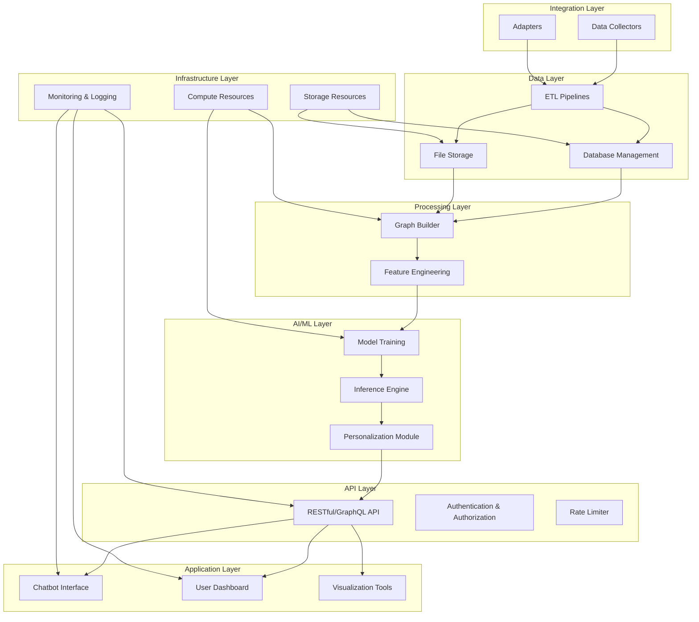

# Metabolism-Specific Protein API

This project aims to provide **metabolism-specific protein api** based on individual metabolic characteristics. It is an open-source initiative designed to enhance research and analysis in protein metabolism.

## Objectives

### Phase 1: Open Source Database
- Create an open-source database for protein sequences and their annotations.
- Ensure open access and public availability of the database.
- Collect and organize data for effective setup.

### Phase 2: Graph Construction
- Build a protein graph that represents relationships between proteins based on domain composition.
- Incorporate graph representation techniques, edge weights, and label propagation.

### Phase 3: AI Agent for Prediction
- Develop an AI agent to predict protein metabolic pathways.
- Leverage the AI agent for personalized medicine and protein function prediction.

### Phase 4: Final Product (Chatbot)
- Design a chatbot interface to provide personalized protein recommendations.
- Enable precise interventions tailored to individual metabolic profiles through an intuitive user interface.

## Project Modules
The project is divided into several modules to manage different aspects of the database and its functionalities:
- **Core Modules**:
  - `common-rest`
  - `uniprotkb-common`, `uniprotkb-rest`
  - `idmapping-common`, `idmapping-rest`
  - `uniparc-common`, `uniparc-rest`
  - `uniref-common`, `uniref-rest`
  - `support-data-common`, `support-data-rest`
  - `async-download-rest`
  - `proteome-rest`
  - `unisave-rest` (versioning)
  - `aa-rest` (amino acid data)
  - `benchmark-rest` (benchmarking)
- **Pending Modules**:
  - `help-centre-rest` (support/help functionality)
  - `jacoco-aggregate-report` (test coverage reporting)

## Installation
1. Clone the repository:
   ```bash
   git clone <repository-url>
   cd <repository-folder>

## Technical Arcitecture

A comprehensive technical vision for an exceptional project:




1- Infrastructure Layer provides the foundational resources for compute, storage, and monitoring/logging.

2- Data Layer handles the ingestion, storage, and preprocessing of protein data.

3- Processing Layer builds protein graphs and performs feature engineering for downstream AI/ML tasks.

4- Processing Layer builds protein graphs and performs feature engineering for downstream AI/ML tasks.

5- AI/ML Layer trains and runs models to generate predictions and personalized insights.

6- API Layer exposes functionality to external systems and the application layer.

7- Application Layer offers a chatbot interface, dashboards, and visualization tools for user interaction.

8- Integration Layer manages external data ingestion and system interoperability.
